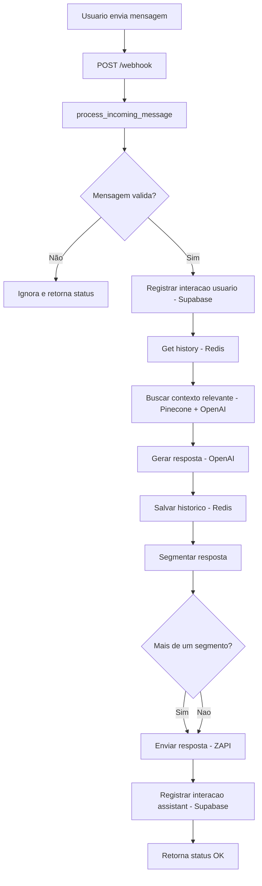
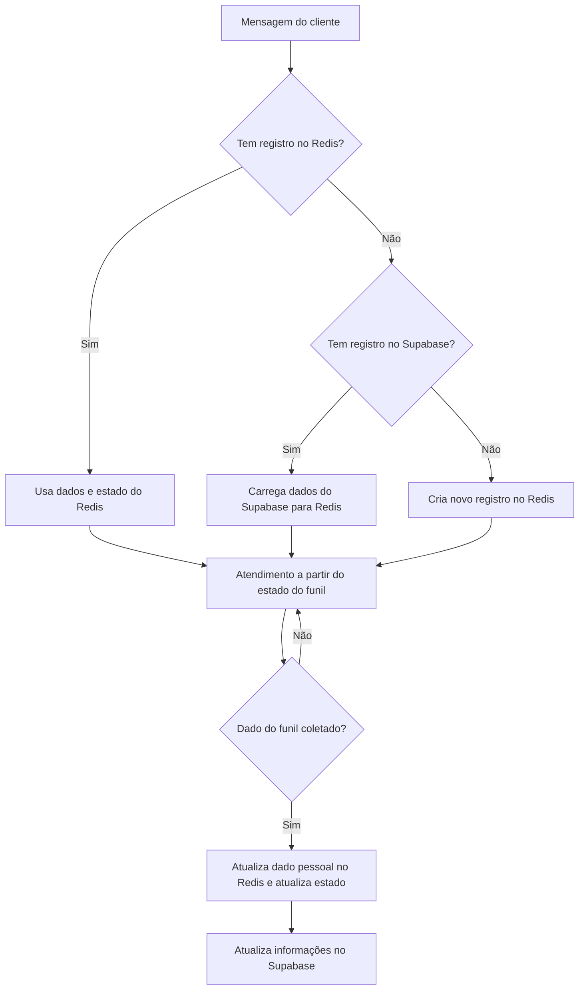
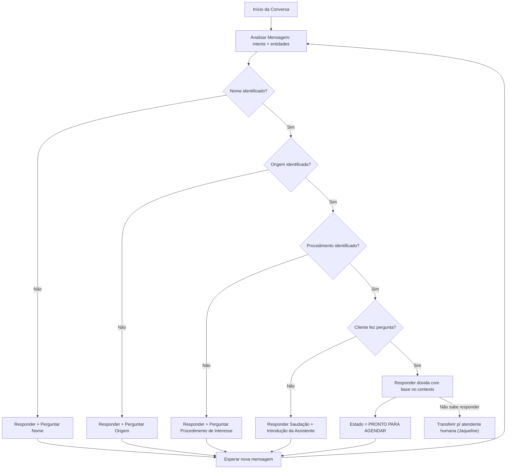

# 📚 Fluxo Detalhado do Projeto Boolish Recepcionista

Este documento descreve detalhadamente o fluxo do projeto, seguindo o caminho do `main.py` até o final das dependências, explicando cada parte do código e sua função no sistema.

---

## 1. main.py

```python
from fastapi import FastAPI
from app.router.webhook import router as webhook_router

app = FastAPI()
app.include_router(webhook_router)
```
**Função:**  
Ponto de entrada da aplicação FastAPI. Cria a instância do FastAPI e inclui o roteador `webhook_router`, que define as rotas de API relacionadas ao webhook.

**Resumindo:**
O arquivo `main.py` é o ponto de entrada da sua aplicação FastAPI.
Ele importa e instancia a aplicação.
Ele importa um conjunto de rotas (relacionadas a "webhook") e as adiciona à aplicação principal.
Assim, quando você rodar a aplicação, todas as rotas definidas no webhook_router estarão ativas.

---

## 2. app/router/webhook.py

```python
from fastapi import APIRouter, Request
from app.services.message_handler import process_incoming_message

router = APIRouter()

@router.post("/webhook")
async def receber_mensagem(request: Request):
    body = await request.json()
    return await process_incoming_message(body)

@router.get("/ping")
def ping():
    return {"pong": True}
```
**Função:**  
Define as rotas da API.

- `POST /webhook`: Recebe mensagens (provavelmente de um serviço externo como WhatsApp via Z-API) e delega o processamento para `process_incoming_message`.
- `GET /ping`: Rota de teste para verificar se o serviço está online.

---

## 3. app/services/message_handler.py

### Função principal: `process_incoming_message`

**Responsabilidade:**  
Orquestra todo o fluxo de processamento de uma mensagem recebida.

**Passos detalhados:**
1. **Filtra mensagens:** Ignora mensagens enviadas por si mesmo, pela API ou de grupos.
2. **Extrai dados:** Obtém o texto da mensagem, número do cliente e telefone da empresa.
3. **Registra a mensagem recebida:** Usa `registrar_interacao` para salvar no banco (Supabase) que o usuário enviou uma mensagem.
4. **Recupera histórico:** Busca o histórico de conversas do usuário no Redis (`get_history`).
5. **Busca contexto relevante:** Usa IA (Pinecone + OpenAI) para buscar trechos relevantes ao contexto da mensagem (`search_best_chunks`).
6. **Gera resposta via IA:** Usa o histórico, contexto e a mensagem para gerar uma resposta com a OpenAI (`generate_answer_via_api`).
7. **Atualiza histórico:** Salva o novo histórico no Redis (`save_history`).
8. **Segmenta resposta:** Divide a resposta em partes menores para envio (`split_sentences`).
9. **Envia resposta:** Envia cada segmento da resposta para o usuário via Z-API (`enviar_resposta_para_zapi`).
10. **Registra resposta enviada:** Salva no banco que o assistente enviou uma resposta.

---

## 4. Dependências detalhadas

### a) Histórico de Conversa (Redis)
- **Arquivo:** `app/core/memory.py`
- **Funções:**
  - `get_history(phone)`: Busca o histórico de mensagens do usuário no Redis. Se não existir, retorna um prompt inicial padrão.
  - `save_history(phone, history)`: Salva as últimas 20 mensagens do histórico no Redis.
- **Objetivo:** Manter o contexto da conversa para respostas mais inteligentes e personalizadas.

### b) Envio de Mensagens (Z-API)
- **Arquivo:** `app/adapters/zapi_client.py`
- **Função:** `enviar_resposta_para_zapi(numero, mensagem)`
  - Envia a mensagem para o usuário via API da Z-API.
  - Em caso de falha, enfileira a mensagem para tentar novamente depois.
- **Objetivo:** Garantir que o usuário receba a resposta, mesmo em caso de instabilidade da API.

### c) IA e Contexto (OpenAI + Pinecone)
- **Arquivo:** `app/adapters/ai_engine.py`
- **Funções:**
  - `search_best_chunks(query, top_k)`: Busca, via Pinecone, os trechos mais relevantes do contexto para a pergunta do usuário.
  - `generate_answer_via_api(query, relevant_chunks, memory)`: Gera a resposta usando o modelo da OpenAI, considerando o histórico e o contexto relevante.
- **Objetivo:** Fornecer respostas precisas, contextualizadas e alinhadas ao escopo da empresa.

### d) Segmentação de Resposta
- **Arquivo:** `app/services/sentence_splitter.py`
- **Função:** `split_sentences(text)`
  - Divide o texto da resposta em frases, respeitando abreviações comuns.
- **Objetivo:** Facilitar o envio de respostas longas em partes menores, melhorando a experiência do usuário.

### e) Registro de Interações (Supabase)
- **Arquivo:** `app/adapters/supabase_client.py`
- **Função:** `registrar_interacao(telefone_cliente, telefone_empresa, sender, mensagem)`
  - Salva cada mensagem enviada/recebida em uma tabela do Supabase, com data, hora, números e conteúdo.
- **Objetivo:** Manter um registro completo das interações para análise, auditoria ou histórico.

---

## Resumo do Fluxo

1. **Usuário envia mensagem** → Chega no endpoint `/webhook`.
2. **Mensagem processada:**
   - Registrada no banco.
   - Histórico recuperado.
   - Contexto buscado via IA.
   - Resposta gerada via IA.
   - Histórico atualizado.
   - Resposta segmentada e enviada ao usuário.
   - Resposta registrada no banco.
3. **Todo o fluxo é assíncrono e resiliente**, com tentativas e logs para falhas.

---

## Fluxograma do Fluxo Principal



### Como interpretar:
- Cada bloco representa uma etapa do fluxo.
- As setas mostram a ordem das operações.
- Decisões (como validação da mensagem) são representadas por losangos.
- O fluxo cobre desde o recebimento da mensagem até o envio da resposta e registro das interações.

## Fluxo de Dados



### Fluxo do funil



### Agendamento via google agenda.
```mermaid
flowchart LR
  subgraph Chatbot
    C[Cliente] -->|mensagem| API[FastAPI Chat API]
    API --> State[State Machine]
    State -->|pronto_para_agendar| ScheduleSvc
  end

  subgraph Scheduling Service
    ScheduleSvc[FastAPI Schedule Service]
    ScheduleSvc --> Auth[OAuth2 Service Account]
    ScheduleSvc --> GC[Google Calendar API]
    ScheduleSvc --> Cache[Redis – disponibilidade cache]
  end

  ScheduleSvc -->|evento criado| AnalyticsDB[(Supabase)]
  ScheduleSvc -->|evento criado| CRM[HubSpot API]
  ```

  
